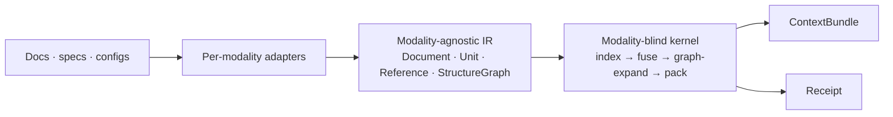

# omnex

**Universal, structure-aware retrieval — at a fraction of the tokens.**

[](https://github.com/Mathews-Tom/omnex/actions/workflows/ci.yml)
[](https://www.python.org/downloads/)
[](LICENSE)
[](pyproject.toml)

---

omnex is a deterministic, local-first retrieval engine for structured corpora — docs, specs, and configs today; code and perceptual modalities on the roadmap. It ingests each modality through a dedicated adapter, normalizes the result into one modality-agnostic intermediate representation (IR), and runs a tiered, **modality-blind kernel** over that IR: index, fuse, expand along structural edges, and pack *whole units* into a fixed token budget instead of spraying fragments into the prompt.

Every query returns a **`ContextBundle`** for the model plus an auditable **`Receipt`** that states what was returned, which tier ran, whether any model was invoked, and which determinism guarantee the run may claim. No hosted inference. No API key. No vector database to stand up.

**Start:** [omnex vs archex](#omnex-vs-archex-do-i-need-both) · [The tier ladder](#the-tier-ladder) · [Install](#install) · [Quickstart](#quickstart-cli) · [Python API](#python-api) · [MCP server](#mcp-server) · [Measured results](#measured-results)

**Quick links:** [What omnex returns](#what-omnex-returns) · [Why it's different](#why-omnex-is-different) · [How it works](#how-it-works) · [Determinism & receipts](#determinism--receipts) · [Benchmarks](#benchmarks-run-it-yourself) · [Status & roadmap](#status--roadmap) · [Independence from archex](#independence-from-archex) · [Development](#development)

**Operate:** [install-client](#register-it-with-install-client) · [RAG retrievers](#rag-framework-retrievers) · [Docker](#docker) · [Diagnostics](#diagnostics-doctor) · [Usage metrics](#usage-metrics)

---

## omnex vs archex (do I need both?)

omnex is the standalone successor in spirit to [**archex**](https://github.com/Mathews-Tom/archex), but the two are **independent projects** that share design ideas, not code. Direct answers to the common questions:

- **Do I need both, or just one?** Just one — pick by corpus. They never depend on each other and can be installed side by side without conflict (both are local-first, deterministic, and ship a CLI plus an MCP server). omnex carries **zero** archex dependency.
- **Does omnex replace archex?** **No — they are complementary.** archex is purpose-built for code (tree-sitter parsing across many languages, deep import/call graphs). omnex is the universal substrate for *non-code* structured corpora (prose, OpenAPI/JSON-Schema specs, configs). omnex has **no code adapter yet**, so it does not replace archex for code today. A code adapter is a future track (an eventual archex-on-omnex migration is possible but unbuilt).

| | **archex** | **omnex** |
| --- | --- | --- |
| Scope | Code repositories | Prose, structured specs, configs (code later) |
| Structure source | AST / import / call graph (tree-sitter) | Per-modality adapters → one shared IR |
| Determinism | Deterministic, LLM-free | **Tiered:** byte-exact floor + opt-in model/vector lanes (labeled in the receipt) |
| Output | Context bundle + receipt | `ContextBundle` + `Receipt` |
| Surfaces | CLI · MCP · Python · Docker | CLI · MCP · Python · Docker |
| Use when | Your corpus is source code | Your corpus is docs, API specs, schemas, configs |

**Rule of thumb:** code → archex; everything structured-but-not-code → omnex; mixed shop → run both.

## The tier ladder

omnex resolves a real tension instead of papering over it: lexical-only retrieval under-recalls semantic search on prose, so a single configuration cannot be *prose + FTS-only + beats-embeddings* at once. The answer is an explicit ladder of tiers, each with its own determinism class and honest win bar — not one fuzzy slider.

| Tier | Adds | Determinism class | Best for | Claim | Status |
| --- | --- | --- | --- | --- | --- |
| **T0** (default floor) | FTS5/BM25F + efficiency packer | `byte_exact`, LLM-free, offline | any modality | far fewer tokens than full-dump; zero model; reproducible; auditable | ✅ shipped |
| **T1** | deterministic graph **closure** expansion | `byte_exact`, LLM-free | structured specs / code (`$ref` / FK / import edges) | complete reference-closure at budget; ≤ chunk-and-embed tokens at equal recall | ✅ shipped |
| **T2** | local embedding lane (opt-in `[embed]` extra) | `pinned_reproducible` (model + tokenizer + runtime + arch) | prose / NL queries | ≤ chunk-and-embed tokens at equal recall on prose | ✅ shipped (opt-in) |
| **T3** | model extraction (OCR / caption / transcribe) | `model_versioned` (cached by content hash) | scanned PDF / image / audio / video | structured retrieval over non-text inputs at all | 🚧 roadmap |

T0 and T1 are **byte-exact and model-free**. T2 is opt-in, off by default, and recorded as a weaker determinism class — the deterministic headline never bleeds across tiers. The CLI and MCP surfaces run the **T0 floor** by default; T1 closure and T2 vector retrieval are selected by passing a `KernelConfig` through the Python API (and are what the benchmark families exercise).

## What omnex returns

omnex returns **context, not an answer**. The downstream model still reasons; omnex decides which units belong in the prompt and records why that selection is safe.

A spec query (`omnex query tests/fixtures/payments_openapi.json "create payment" --format markdown`) returns the packed bundle followed by its receipt:

```text
paths / POST /payments:
{ "summary": "Create a payment", "requestBody": { ... "$ref": ".../PaymentRequest" } ... }

components / schemas / PaymentRequest:
{ ... "amount": { "$ref": ".../Money" }, "customer": { "$ref": ".../Customer" } }

components / schemas / Money:
{ ... }

## Receipt

- returned_tokens: 128
- baseline_tokens: 264
- tiers_run: T0
- model_used: False
- determinism_class: byte_exact
- reference_closure_complete: False
- recall_basis: lexical
```

The `Receipt` is a frozen value — identical inputs produce a byte-identical receipt. Its fields:

| Field | Meaning |
| --- | --- |
| `returned_tokens` / `baseline_tokens` | emitted tokens vs the full-dump upper bound |
| `tiers_run` | which tiers were exercised this run |
| `model_used` / `model_version` | whether an embedding/extraction model was invoked, and which version |
| `extraction_used` | whether adapter-local model extraction (OCR/etc.) ran |
| `determinism_class` | `byte_exact` · `pinned_reproducible` · `model_versioned` |
| `reference_closure_complete` | `True` only when a tier computed a reference closure **and** emitted every unit in it (exact set membership, never a threshold) |
| `recall_basis` | `lexical` or `lexical_plus_vector` — so a lexical-only run is never mistaken for a semantic one |
| `recall_limitations` | plain-language caveats implied by `recall_basis` |
| `embedding_provenance` | model / tokenizer / runtime / architecture — set only on a T2 run, `None` on the byte-exact floor |

## Why omnex is different

Hybrid search (BM25 + vectors) is table stakes in 2026 — it is not the pitch. omnex's edge is the combination below, aimed at *answer quality through precision*, not just *cost through fewer tokens* (token prices fall; context rot does not):

- **Structure as a dependency graph, not text to rank.** Where the corpus has hard edges (`$ref`, foreign keys, imports, calls), completeness is a *correctness property*, not a ranking preference. Retrieve an OpenAPI operation and T1 walks the `$ref` closure deterministically — pulling exactly its request/response schemas, deduping shared ones — instead of hoping similarity surfaces every required neighbor.
- **Deterministic by default, with receipts.** T0/T1 are byte-exact, offline, and auditable. The receipt turns retrieval from a black box into an inspectable step for CI gates, regulated workflows, and air-gapped environments.
- **Whole units, never fragments.** The packer chooses among `INCLUDE → COMPRESS → ELIDE → SKIP` per unit under the budget, and a `protect` flag hard-guards code blocks, tables, and payload manifests from compression. Fewer, complete, on-target units reduce distractor interference.
- **Zero-infra, local-first.** The core path is SQLite FTS5 + `networkx` traversal + deterministic packing. No service to run, no embeddings required.

## Install

Requires **Python 3.12+**. Uses [`uv`](https://docs.astral.sh/uv/).

```bash
# Core (T0/T1 — byte-exact, model-free)
uv tool install omnex

# With the opt-in T2 vector lane
uv tool install "omnex[embed]"

# With the MCP server surface
uv tool install "omnex[mcp]"
```

To add omnex as a project dependency, use `uv add omnex` (with extras as `uv add "omnex[embed]"`). Install the latest unreleased build from source with `uv tool install "omnex @ git+https://github.com/Mathews-Tom/omnex"`.

Extras: `embed` (T2 local embeddings via `fastembed`), `mcp` (MCP stdio server), `langchain` / `llamaindex` (RAG framework retrievers), `bench` (chunk-and-embed benchmark baseline; pulls `embed`). The core install pulls only `networkx`, `tiktoken`, and `click` — importing `omnex` loads no model, opens no socket, and reads no file.

## Quickstart (CLI)

```bash
# Validate + summarize a corpus (routes each source through its adapter, fails loud if none claims it)
omnex index path/to/spec.json
# → indexed 1 document(s), 19 unit(s), 7 reference(s)

# Query under a token budget (T0 floor; markdown or json)
omnex query path/to/spec.json "create payment" --budget 400 --format markdown
omnex query path/to/docs/ "configure TLS for the ingress" --budget 2000 --format json
```

`index` and `query` accept a file or a directory. Output is deterministic for a fixed corpus, question, and budget.

## Python API

The library is the source of truth; the CLI and MCP server are thin wrappers over it. Unlike the surfaces, the library exposes **no implicit default config** — every run states its tier explicitly.

```python
from pathlib import Path
from omnex import api, KernelConfig

# T1: deterministic reference-closure over a spec
cfg = KernelConfig(
    tier="T1",
    bm25_profile={"title": 2.0, "breadcrumb": 1.5, "text": 1.0, "summary": 1.0},
    hop_budget_by_kind={"REFERENCES": 6, "CONTAINS": 2},
    confidence_decay=0.9,
    enable_vector_lane=False,
    enable_rerank=False,
)

bundle, receipt = api.query_sources([Path("spec.json")], "create payment", 400, cfg)

print(receipt.tiers_run)                    # ('T0', 'T1')
print(receipt.reference_closure_complete)   # True  — every unit in the $ref closure was emitted
print(receipt.determinism_class)            # 'byte_exact'
print(receipt.returned_tokens, receipt.baseline_tokens)  # 169 264
```

Surface area exported from the top-level package:

- `index(corpus, references=())` / `query(corpus, question, budget_tokens, config, references=())` — operate on in-memory IR (`Unit`/`Reference`).
- `index_sources(sources)` / `query_sources(sources, question, budget_tokens, config)` — route file/dir paths through their adapters into IR first.
- Types: `ContextBundle`, `Receipt`, `KernelConfig`, `Document`, `Span`, `Unit`, `Reference`, and the `Tier` / `DeterminismClass` / `RecallBasis` / `EmbeddingProvenance` literals.

For repeated queries over one corpus, build the kernel once with `index_sources(...)` and reuse it.

## MCP server

Install the `[mcp]` extra, then register the stdio server with your MCP client:

```json
{
  "mcpServers": {
    "omnex": { "command": "omnex-mcp", "args": [] }
  }
}
```

It exposes two tools — `index(paths)` and `query(corpus, question, budget=4000)` — that return the **same** byte-exact T0 bundle and receipt the library and CLI produce. The MCP module is never imported by `import omnex`, so the core install is unaffected; importing it without the extra fails loud.

### Register it with `install-client`

Instead of hand-writing that JSON, `omnex install-client <client>` writes it for you across six clients — **Claude Code, Codex, Cursor, OpenCode, Pi, and oh-my-pi (`omp`)** — merging an `omnex` entry into the client's existing config without clobbering unrelated sections:

```bash
omnex install-client claude-code                 # user/global scope (default)
omnex install-client cursor . --scope project    # repo-local config
omnex install-client codex --dry-run             # preview the target + config, write nothing
omnex install-client omp --agent-file ~/.omp/agent/AGENTS.md  # also append agent guidance
```

`--scope` selects user/global (default) or repo-local `project`; Pi and oh-my-pi are user-only. `--dry-run` prints the resolved target and config and writes nothing. `--agent-file` appends a ready-to-paste, idempotent guidance block so agents reach for the `index`/`query` MCP tools instead of only the CLI.

**Registration is not surfacing is not invocation.** Writing the config registers the server; a harness still has to surface its tools to the agent (harnesses with on-demand tool discovery keep them hidden until activated), and the agent still has to choose them over reading files by hand — which is what `--agent-file` nudges.

## RAG framework retrievers

omnex plugs into existing RAG stacks as a retriever, behind extras — the core install pulls neither framework. Build the kernel once (`index` for in-memory IR, `index_sources` for files), then wrap it; each query returns the framework's document type carrying omnex's packed chunks and the run's receipt as provenance under `omnex_receipt`. Ranking and the returned set are exactly omnex's.

```python
from pathlib import Path
from omnex import index_sources, KernelConfig
from omnex.integrations.langchain import OmnexRetriever  # needs the [langchain] extra

cfg = KernelConfig(
    tier="T0", bm25_profile={"text": 1.0, "title": 2.0},
    hop_budget_by_kind={}, confidence_decay=0.9,
    enable_vector_lane=False, enable_rerank=False,
)
kernel = index_sources([Path("docs/")])
retriever = OmnexRetriever(kernel=kernel, config=cfg, budget_tokens=2000)

docs = retriever.invoke("configure TLS for the ingress")
print(docs[0].page_content, docs[0].metadata["omnex_receipt"]["determinism_class"])
```

The LlamaIndex retriever mirrors it — `from omnex.integrations.llamaindex import OmnexLlamaRetriever` (the `[llamaindex]` extra), `retriever.retrieve(query)` returns `NodeWithScore` nodes carrying the same chunks and `omnex_receipt` provenance.

## Docker

Two images ship from the repo root, neither published to a registry — build them locally:

```bash
# Slim: the core-only CLI (byte-exact T0/T1, no extras).
docker build -f Dockerfile.slim -t omnex:slim .
docker run --rm -v "$PWD:/work:ro" omnex:slim query /work/spec.json "create payment" --budget 400

# Full: core + the [embed] T2 vector lane + the [mcp] stdio server.
docker build -f Dockerfile.full -t omnex:full .
```

Both run as an unprivileged user and read a corpus mounted at runtime; `ENTRYPOINT` is `omnex`, so any subcommand (`query`, `index`, `doctor`, …) follows the image name.

### Warm-container `omnex-mcp`

The full image bundles the `[mcp]` extra, so it can run the stdio MCP server as the container's resident process. Keeping one container alive across a session avoids paying interpreter and adapter import cost on every call — register the long-lived container as the MCP command instead of spawning a fresh `omnex-mcp` per request:

```json
{
  "mcpServers": {
    "omnex": {
      "command": "docker",
      "args": ["run", "-i", "--rm", "-v", "${workspaceFolder}:/work:ro", "--entrypoint", "omnex-mcp", "omnex:full"]
    }
  }
}
```

The `-i` flag keeps stdin open for the MCP stdio transport. omnex is stateless (see the [persistence-model decision](docs/system-design.md)), so a warm container keeps the process — not a persisted index — warm: each query still re-routes its mounted corpus through the adapters, with no cross-session index on disk.

## Diagnostics (`doctor`)

`omnex doctor` reports installation and operational health in one place: whether the `omnex-mcp` server is registered with your MCP clients (reusing the six `install-client` targets — no duplicated path knowledge), the usage-metrics ledger state, which extras are installed, adapter sanity, and the persistence mode (`stateless`).

```bash
omnex doctor                  # human-readable report
omnex doctor --format json    # machine-readable, stable schema
omnex doctor --strict         # exit non-zero if any check is not "ok"
```

Use `--strict` in a setup script or CI step to fail fast when, for example, no client is registered or an expected extra is missing.

## Usage metrics

omnex can keep a **local-only, off-by-default** ledger of token savings — no network, no upload, and no query text, paths, or symbols ever stored. It is **CLI-only**: the MCP server exposes no metrics tools, so an agent can route retrieval through omnex but can never read, change, or delete your metrics state.

```bash
omnex metrics enable                 # opt in (also honored via OMNEX_USAGE_METRICS=1)
omnex query spec.json "create payment" --budget 400   # records one anonymous event
omnex metrics summary                # labeled token savings + the CLI-vs-MCP split
omnex metrics summary --format json  # machine-readable
omnex metrics export                 # every event as JSON — anonymous counters only
omnex metrics delete                 # wipe the ledger (the enable setting is kept)
omnex metrics trace                  # a separate, second opt-in; stores no source/output
```

The ledger lives at `~/.omnex/usage.sqlite` (override the home with `OMNEX_HOME`). Savings are derived from each receipt's `returned_tokens` vs `baseline_tokens` — a full-file-paste baseline and a targeted-read counterfactual, with the whole-corpus figure demoted and labeled. With metrics disabled (the default) no ledger file is created and nothing is recorded.

## Measured results

All numbers below are from the checked-in artifacts under [`benchmarks/results/`](benchmarks/results), regenerated by `omnex-bench`. The token ledger is a whitespace word count (`omnex.kernel.packer.count_tokens`); latency is environment-dependent and **excluded** from the determinism guarantee.

### Specs (T1 — the strong-moat proof)

Corpus: a 938-token commerce OpenAPI spec. Recall held at **1.00** for every method; omnex returns the exact `$ref` closure, the baseline over-retrieves to stay safe.

| Task | omnex T1 | chunk-and-embed | full dump | omnex F1 | c&e F1 |
| --- | --- | --- | --- | --- | --- |
| create_payment | **210** | 917 | 938 | 1.00 | 0.55 |
| dispatch_shipment | **259** | 1065 | 938 | 1.00 | 0.67 |
| enroll_subscriber | **191** | 1065 | 938 | 1.00 | 0.55 |
| **Total** | **660** | 3047 | 2814 | — | — |

omnex T1 spends **~0.22× the tokens of the chunk-and-embed headline at equal (1.00) recall**, with higher F1 — completeness is *provable* (transitive closure of real edges), not probabilistic. p95 ≈ 9 ms.

### Prose (T0 honest floor, T2 competitive lane)

Corpus: a 489-token docs set. T0 is the **lexical byte-exact floor** vs the full-dump upper bound, reported at omnex's *achieved* recall:

| Task | omnex T0 | full dump | omnex recall | reaches full recall? |
| --- | --- | --- | --- | --- |
| configure_tls | **82** | 489 | 0.67 | no — lexical ceiling |
| provision_storage | **113** | 489 | 1.00 | yes |

T0 honestly **trails embeddings** where query and content vocabulary diverge (the "Securing traffic with certificates" page never says *TLS*). The opt-in **T2 vector lane** closes that gap against the chunk-and-embed headline (`BAAI/bge-small-en-v1.5`, 256/32 chunks) at recall **1.00**:

| Task | omnex T2 | chunk-and-embed | full dump |
| --- | --- | --- | --- |
| configure_tls | **384** | 543 | 489 |
| provision_storage | **195** | 217 | 489 |
| **Total** | **579** | 760 | 978 |

T2 reaches the chunk-and-embed recall at fewer-or-equal tokens, but is the weaker `pinned_reproducible` class: those counts reproduce only with the recorded model, tokenizer, runtime, and architecture (all captured in the receipt). p95 ≈ 1.07 s (model load); T0 p95 ≈ 87 ms.

## How it works



**The IR is the contract.** Adapters are the *only* thing that is modality-specific; the kernel never parses raw bytes and never knows the modality. Four shapes:

- `Document` — content-addressed source (uri, modality, content hash, raw token count).
- `Unit` — the retrievable/packable atom: span back to source, text, token count, title, breadcrumb, `kind` (`SECTION`/`TABLE`/`OPERATION`/`SCHEMA`/…), and `protect`.
- `Reference` — a typed, confidence-weighted directed edge (`CONTAINS`/`CROSS_REF`/`CITES`/`REFERENCES`/`FOREIGN_KEY`/`IMPORTS`/`CALLS`/…).
- `StructureGraph` — a `networkx` DiGraph over units and references that drives expansion.

The IR is **versioned, not marketed as immutable** — expect a deliberate revision when the next adapter lands.

**Adapters** (`ModalityAdapter` Protocol: `claims` → `ingest` → `parse` → `link` → `capabilities`). Shipped today:

- **Spec adapter** — OpenAPI / JSON-Schema → `OPERATION`/`SCHEMA`/`FIELD` units with `REFERENCES` (`$ref`) and `FOREIGN_KEY` edges. Enables T1 closure.
- **Prose adapter** — Markdown / reStructuredText → `SECTION`/`PARAGRAPH`/`TABLE` units with `CONTAINS`/`SIBLING`/`CROSS_REF`/`CITES` edges and token-aware splitting.

Model-backed extraction (OCR, captioning) is reserved for adapter-local T3 lanes — off by default, receipt-recorded, and **fail-loud** when required structure is unavailable (a unit is flagged `extraction=absent`, never silently dropped or fabricated).

**Kernel** (modality-blind, behavior selected by `KernelConfig`): a generic SQLite **FTS5/BM25F** index over `text`/`title`/`breadcrumb`/`summary`; **RRF + relative-score fusion** over unit ids; **graph expansion** with per-kind hop budgets and confidence decay (T1 computes deterministic transitive closure); an optional **vector lane** (T2); and the **packer** — relevance-per-token scoring with a graph-distance penalty and the `INCLUDE → COMPRESS → ELIDE → SKIP` chain. In T0/T1, `COMPRESS` is strictly deterministic and extractive (no model), enforced by test.

## Determinism & receipts

Same corpus + same config + same query ⇒ same bundle and a byte-identical receipt, on the byte-exact tiers. The receipt is how omnex keeps the headline honest:

- T0/T1 report `byte_exact` and `model_used: False`.
- T2 reports `pinned_reproducible` and stamps `embedding_provenance`.
- `reference_closure_complete` is an exact set-membership fact, never a confidence threshold.
- `recall_basis` + `recall_limitations` state in plain language when recall is lexical-only and where it will trail embeddings.

## Benchmarks (run it yourself)

```bash
# Spec family: omnex T1 vs the chunk-and-embed headline (needs the [bench]/[embed] extra)
omnex-bench run --family specs --embedder bge-small --out benchmarks/results

# Prose family: omnex T0 vs the full-dump upper bound at omnex's achieved recall
omnex-bench run --family prose --out benchmarks/results

# Deterministic baseline without a model download
omnex-bench run --family specs --embedder tfidf --out benchmarks/results
```

The corpus *shape* selects the comparison: a single-file corpus runs the spec-style T1-vs-chunk-and-embed comparison; a directory corpus runs the prose-style T0-vs-full-dump comparison. The benchmark is **offline and never a product path** — the embedding model is a benchmark dependency only, never part of omnex's deterministic retrieval.

Honesty discipline baked into the families: two baselines (full-dump upper bound is *demoted*; a pinned strong chunk-and-embed config is the *headline*), tokens-at-fixed-recall, F1, and p95.

## Status & roadmap

**Alpha (`0.1.0`), published to [PyPI](https://pypi.org/project/omnex/).** Shipped: the modality-agnostic IR + `StructureGraph`; spec and prose adapters; the modality-blind kernel (FTS5/BM25F, RRF/RSF fusion, bounded graph expansion, T1 closure, the efficiency packer); the opt-in T2 vector lane; receipts; the labeled spec + prose benchmark families; and the surfaces and adoption layer — library, CLI, MCP, slim/full Docker images, LangChain/LlamaIndex retrievers, cross-client `install-client` registration, local usage metrics, and `doctor` diagnostics.

Roadmap, each as its own spec → plan → implementation cycle:

- **T3** model-extraction lane (OCR for scanned PDF; caption/transcribe).
- **Code adapter** (tree-sitter → `FUNCTION`/`CLASS` units, `IMPORTS`/`CALLS` edges) — the seam for an eventual archex-on-omnex migration.
- **Mixed-corpus cross-modality linking** (prose ↔ code).

## Independence from archex

omnex is an original implementation. Its `src/` and `tests/` contain **no reference to `archex`** and its dependency tree carries no archex package — archex was studied as a *reference design* (deterministic packing, structural expansion, receipts) and reimplemented universal-first over a modality-agnostic IR. The dependency arrow never points back at a code-specialized tool.

## Development

```bash
git clone https://github.com/Mathews-Tom/omnex
cd omnex
uv sync

uv run ruff check . && uv run ruff format --check .   # lint + format
uv run mypy --strict src/omnex tests                  # types
uv run pytest                                          # tests
```

CI runs the same four gates on every push and PR. Standards: Python 3.12, `from __future__ import annotations`, built-in generics / `|` unions, `mypy --strict`.

## Documentation

**Get started**
- [Installation](docs/INSTALLATION.md) — install methods, extras, Docker, what omnex reads/writes, network behavior, uninstall.
- [Usage](docs/USAGE.md) — end-to-end guide across the CLI, Python API, MCP server, and RAG retrievers.

**Reference**
- [Receipts](docs/RECEIPTS.md) — the auditable receipt contract: fields, determinism classes, recall basis.
- [Local metrics](docs/LOCAL_METRICS.md) — the off-by-default usage ledger, savings math, and the privacy boundary.
- [Client compatibility](docs/CLIENT_COMPATIBILITY.md) — `install-client` targets, config shapes, and scopes for all six clients.

**Design**
- [System overview](docs/system-overview.md) — what, why (context rot, token economics), market framing.
- [System design](docs/system-design.md) — IR contract, adapter Protocol, kernel internals, tier semantics.
- [Roadmap](docs/ROADMAP.md) — shipped in 0.1.0 vs planned, and the principles guiding future work.

**Project**
- [Contributing](CONTRIBUTING.md) — local workflow, gates, coding standards, and the adapter contract.
- [Security](SECURITY.md) — security posture and how to report a vulnerability.
- [Changelog](CHANGELOG.md) — release history.

## License

[Apache License 2.0](LICENSE).
