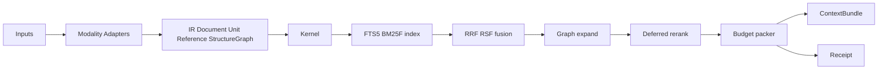
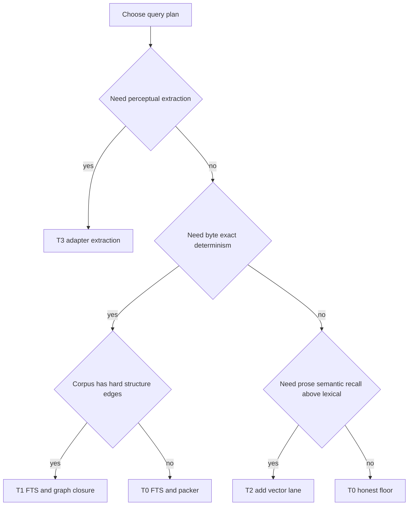
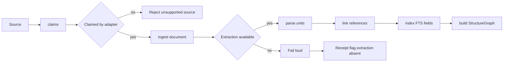
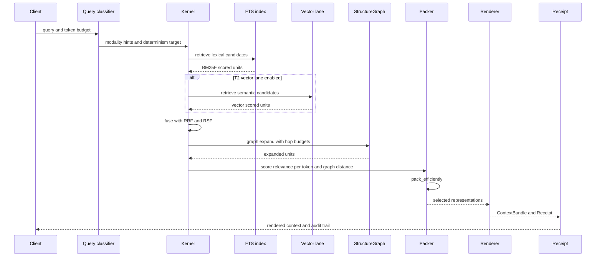
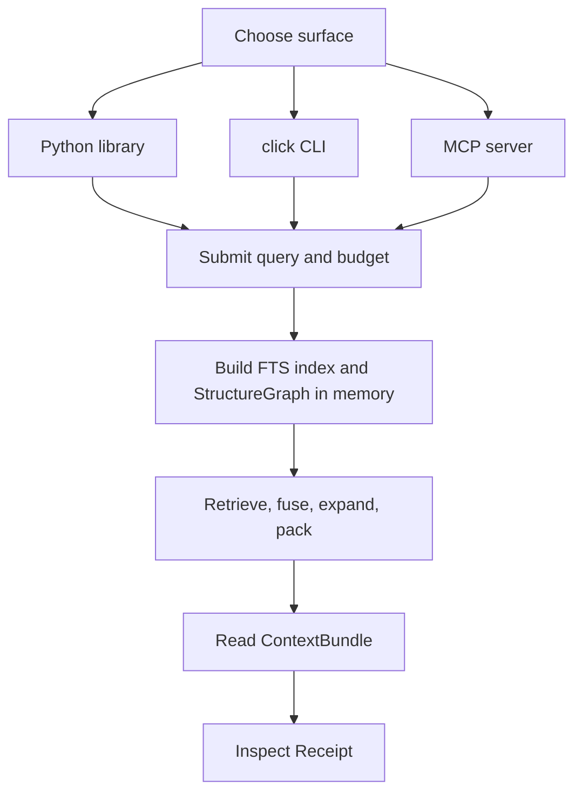
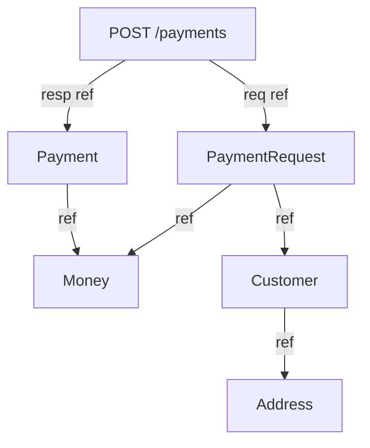

# omnex system design

> omnex — Universal, structure-aware retrieval — at a fraction of the tokens.

## 1. Architecture overview

omnex is a deterministic, local-first retrieval engine with a hard separation between modality handling and retrieval. Inputs are normalized by per-modality adapters into one modality-agnostic IR. The kernel then runs the same retrieval pipeline for specs, code, prose, and any future modality that can emit the IR: index, fuse, graph-expand, optionally rerank, and pack into a token budget. The output is always a `ContextBundle` plus a `Receipt`.

The load-bearing invariant is that the kernel is LLM-free and modality-blind. It does not parse raw source formats, it does not know about PDF internals or OpenAPI syntax, and it does not call a model to do its job. Model use is allowed only in explicitly opt-in lanes outside that invariant: adapter-local extraction for T3 and the optional vector lane for T2. Both must be receipt-recorded.



## 2. The IR stable contract

The IR is the system boundary. Adapters are allowed to be modality-specific; the kernel is not. That only works if every adapter emits the same four-shape contract.

```python
from __future__ import annotations

from dataclasses import dataclass
from typing import Literal

import networkx as nx

Modality = Literal["prose", "code", "spec", "config", "pdf", "image", "audio", "video"]
UnitKind = Literal[
    "SECTION",
    "PARAGRAPH",
    "TABLE",
    "FIGURE_CAPTION",
    "FUNCTION",
    "CLASS",
    "OPERATION",
    "SCHEMA",
    "FIELD",
]
ReferenceKind = Literal[
    "CONTAINS",
    "SIBLING",
    "CROSS_REF",
    "CITES",
    "LINKS_TO",
    "IMPORTS",
    "CALLS",
    "REFERENCES",
    "FOREIGN_KEY",
]


@dataclass(frozen=True, slots=True)
class Document:
    id: str
    uri: str
    modality: Modality
    content_hash: str
    raw_token_count: int


@dataclass(frozen=True, slots=True)
class Span:
    start: int
    end: int


@dataclass(frozen=True, slots=True)
class Unit:
    id: str
    document_id: str
    span: Span
    text: str
    token_count: int
    title: str | None
    breadcrumb: tuple[str, ...]
    kind: UnitKind
    summary: str | None
    protect: bool


@dataclass(frozen=True, slots=True)
class Reference:
    source_id: str
    target_id: str
    kind: ReferenceKind
    confidence: float
    evidence: tuple[str, ...]


StructureGraph = nx.DiGraph
```

`Unit` is the retrievable and packable atom. omnex never splits a unit during retrieval; it chooses whole-unit representations. `protect=True` marks units that must never be compressed or elided: code blocks, tables, formal definitions, and payload fragments such as the YAML manifest in the TLS example.

The IR is stable enough to let the kernel stay generic, but it is versioned, not marketed as immutable. Risk #4 in the brief is real: an IR validated by only one real adapter is usually overfit to the first modality. The mitigation is to keep the four shapes fixed while versioning the serialized contract and expecting an intentional revision when adapter #2 lands if the evidence demands it. That preserves kernel isolation without pretending the first draft is final forever.

## 3. Modality adapter contract

Every modality adapter is responsible for modality-specific detection, parsing, and edge recovery. The kernel only accepts IR outputs.

```python
from __future__ import annotations

from dataclasses import dataclass
from pathlib import Path
from typing import Protocol, Sequence


@dataclass(frozen=True, slots=True)
class AdapterCapabilities:
    unit_kinds: frozenset[str]
    reference_kinds: frozenset[str]
    deterministic_parse: bool
    model_extraction_opt_in: bool


class ModalityAdapter(Protocol):
    def claims(self, source: Path) -> bool: ...

    def ingest(self, source: Path) -> Document: ...

    def parse(self, document: Document) -> list[Unit]: ...

    def link(self, document: Document, units: Sequence[Unit]) -> list[Reference]: ...

    def capabilities(self) -> AdapterCapabilities: ...
```

`claims()` gates routing. `ingest()` establishes document identity and content hash. `parse()` emits retrievable units. `link()` recovers typed edges into the `StructureGraph`. `capabilities()` tells the runtime whether the adapter is deterministic, which unit and edge kinds it can emit, and whether model-backed extraction exists.

Model-backed extraction lives inside an adapter, never in the kernel. OCR, captioning, or transcription are opt-in capabilities, off by default, and any invocation must be recorded in the `Receipt` with the model version. If extraction is required but unavailable, omnex fails loud instead of silently degrading into fabricated structure.

## 4. Retrieval kernel internals

The retrieval kernel is modality-blind. It works over `Document`, `Unit`, `Reference`, and `StructureGraph`, with behavior selected by configuration rather than by modality-specific code paths.

```python
from __future__ import annotations

from dataclasses import dataclass
from typing import Literal


Tier = Literal["T0", "T1", "T2", "T3"]
DeterminismClass = Literal["byte_exact", "pinned_reproducible", "model_versioned"]


@dataclass(frozen=True, slots=True)
class KernelConfig:
    tier: Tier
    bm25_profile: dict[str, float]
    hop_budget_by_kind: dict[str, int]
    confidence_decay: float
    enable_vector_lane: bool
    enable_rerank: bool


class RetrievalKernel:
    def retrieve(self, query: str, budget_tokens: int, config: KernelConfig) -> tuple[str, str]: ...

    def fts_search(self, query: str, config: KernelConfig) -> list[str]: ...

    def vector_search(self, query: str, config: KernelConfig) -> list[str]: ...

    def fuse(self, lexical_ids: list[str], vector_ids: list[str]) -> list[str]: ...

    def graph_expand(self, seed_ids: list[str], config: KernelConfig) -> list[str]: ...

    def pack_efficiently(self, candidate_ids: list[str], budget_tokens: int, config: KernelConfig) -> list[str]: ...
```

### Index

The index is a generic SQLite FTS5 table over `Unit.text`, `title`, `breadcrumb`, and `summary`. BM25F weights are not hard-coded per modality in the kernel source; they come from a per-modality profile selected by configuration. T2 adds an optional vector lane through `fastembed`, but the floor remains FTS5 plus BM25F.

### Fusion

Fusion is standard rank fusion over `Unit.id`: reciprocal rank fusion plus relative-score fusion. This is intentionally boring infrastructure. The novelty is not hybrid search; hybrid is table stakes in 2026. omnex uses fusion because it is effective, but the differentiated behavior comes later in structural closure and packing.

### Graph expansion

Graph expansion walks the `StructureGraph` with per-kind hop budgets and confidence decay. The traversal is generic, but the meaning of edges is adapter-defined. For specs, `REFERENCES` and `FOREIGN_KEY` edges are the important ones, and T1 uses them to compute deterministic transitive closure. That is the load-bearing operation for the first proof: when the seed is an operation, the result is the exact request and response closure, deduped by unit id.

### Rerank

Rerank is optional and deferred. The system design leaves room for a future rerank stage, but the first proofs do not depend on it. T0 and T1 stand on lexical ranking, graph closure, and budget-aware packing alone.

### Packer

The packer is the substantial part of the kernel. It scores candidates by relevance per token, then applies a graph-distance penalty so directly relevant units beat far-neighbor context when the budget is tight. It chooses among four representations in a strict chain:

- `INCLUDE`: emit the full unit text.
- `COMPRESS`: emit a deterministic shorter representation.
- `ELIDE`: keep only the identity scaffold needed for continuity such as heading and breadcrumb.
- `SKIP`: omit the unit entirely.

`protect=True` is a hard guard: protected units never enter `COMPRESS` or `ELIDE`. In T0 and T1, `COMPRESS` is explicitly deterministic and model-free. Allowed forms are stub-like heading plus lead paragraph, or extractive top-sentence selection by BM25. Summarization by model is not allowed in the deterministic tiers. A kernel test must assert that `COMPRESS` in T0 and T1 invokes no model.

## 5. Tier system as configuration

The tiers are not a single monotonic slider. Each tier activates a different lane mix and changes the determinism class.

| Tier | Adds | Determinism class | Where it bites | Win bar / claim | Headline baseline |
| --- | --- | --- | --- | --- | --- |
| **T0** (default floor) | FTS5/BM25F + efficiency packer | byte-exact, LLM-free, offline | any modality | "far fewer tokens than full-dump; zero model; reproducible; auditable" | full-document dump (upper bound) |
| **T1** | deterministic graph **closure** expansion | byte-exact, LLM-free | structured specs / code (real `$ref`/FK/import deps) | "complete reference-closure at budget; tokens <= chunk-and-embed at equal recall" | chunk-and-embed top-k |
| **T2** | local embedding lane (opt-in extra) | reproducible only with pinned model + tokenizer + runtime + arch | prose / NL queries | "tokens <= chunk-and-embed at equal recall on prose" | chunk-and-embed (STRONG config) |
| **T3** | model extraction (OCR / caption / transcribe) | cached-by-content-hash, model-versioned in receipt | scanned PDF / perceptual (image/audio/video) | "structured retrieval over non-text inputs at all" | coverage, not tokens |

The honest product stance is fixed by the brief. On specs and code, T1 is still fully deterministic and model-free, so the first strong proof stays on moat while keeping the determinism headline unqualified. On prose, T0 and T1 honestly trail embeddings on recall. T2 is what closes that gap, and the receipt must label it as a different determinism class rather than letting the deterministic headline bleed across tiers.

Example A maps to T1. Example B maps to two honest readings of the same system: T0 is the reproducible floor that beats full-dump on tokens but misses a semantically distant prose page, while T2 adds the vector lane to recover that page and compete with chunk-and-embed on recall and budget.

Applied to the locked prose example, the query is `How do I configure TLS for the ingress controller?` over product docs with an `Ingress` section, a `TLS secrets` subsection with a YAML manifest, and a cross-linked page titled `Securing traffic with certificates` that never says `TLS`. T0 matches the lexical sections and may recover the cross-link only if it is an explicit neighbor. T2 adds the vector lane so the semantically distant page enters the fuse set, after which graph expansion and `protect=True` keep the manifest intact.



## 6. System workflow — ingest and index pipeline

Ingest is adapter-first. The kernel never guesses structure from raw bytes. If the chosen adapter cannot deterministically extract the required structure and opt-in extraction is absent, the pipeline stops and records the failure loudly.



## 7. Query data flow

A query runs through lane selection, retrieval, fusion, structural expansion, packing, rendering, and receipt emission. The same skeleton handles both the deterministic spec path and the prose path with vector enabled.



## 8. User workflow

omnex is intentionally tri-surface: the same indexed corpus and the same receipt semantics are available through the Python library, the `click` CLI, and the MCP server.



The developer workflow is the same across surfaces: submit a query under a budget against a corpus, and inspect the `Receipt` when validating determinism class, included units, token counts, adapter choices, or `extraction=absent` failures. The in-memory index and `StructureGraph` are built per call and discarded when the call returns; nothing is persisted (see §10).

## 9. Worked structural example

Example A is the first-proof path for omnex because it exercises the moat directly. The seed is the `POST /payments` operation. T1 walks the reference graph deterministically until the request and response shapes are complete, dedupes the shared `Money` schema, and packs the minimal complete closure.



The contrast with chunk-and-embed is the point. A semantic top-k often retrieves `POST /payments` and `PaymentRequest`, but misses `Money` and `Address` because those names are not close to the query. Raising `k` to recover them drags in unrelated schemas and wastes tokens. omnex instead computes the transitive closure over hard reference edges, so completeness is provable rather than probabilistic.

## 10. Determinism and caching model

T0 and T1 are byte-exact retrieval classes. Given the same content hash, config, SQLite build, and runtime, they should produce the same unit selection, representation choice, and receipt. That is the determinism headline.

T2 is a different determinism class. It is reproducible only with a pinned embedding model, tokenizer, runtime, and architecture. The `Receipt` must label that class explicitly so users do not read a T0 or T1 guarantee into a vector-assisted run.

T3 is model-versioned rather than byte-exact. Extraction outputs are cached by content hash plus model version, and the cache key must include the extraction model identity because OCR or transcription changes can alter the emitted IR even when the raw source bytes do not.

### Persistence model — stateless (decided)

omnex is **stateless**. Both `index` and `query` build the FTS index and `StructureGraph` in memory on every call and discard them; there is no `.omnex/` folder, no on-disk index, and no persisted cache. `index` validates and reports the corpus shape it *would* index — it does not persist one. This is a deliberate choice over the archex-style persist-then-serve model (a repo-local index served through an `init`/`index`/`status` lifecycle).

The decision turns on three tradeoffs:

- **Cold-start vs warm-query latency.** Stateless pays the full index build on every query; a persisted index would amortize that into warm queries. Accepted, because the per-query build cost is bounded and *correct*, and the warm-query win is recoverable later via an in-process, intra-session cache that never touches disk — so it does not require persistence.
- **On-disk schema versioning.** A persisted artifact is a long-lived format that must be versioned, migrated, and load-rejected across releases. Statelessness has no on-disk format to version.
- **Cache invalidation.** A persisted index goes stale when sources change, making staleness detection (content hashing, dirty detection, revisions) a permanent correctness surface. A per-call rebuild is fresh by construction and has no invalidation surface — which protects the byte-exact T0/T1 determinism guarantee from silent staleness.

Net: stateless accepts higher per-query compute in exchange for eliminating the entire schema-versioning and cache-invalidation surface, and for a minimal failure and security footprint — omnex writes no index to a user's disk.

This gates the operational roadmap. A persisted `.omnex/` lifecycle (`init`/`index`/`status`, a freshness/revision model, and `freshness`/`index_revision` receipt fields) is **not built**: it was conditional on choosing "persisted," so it is dropped and the `Receipt` schema is unchanged. Health diagnostics (`doctor`) report persistence mode as `stateless` and omit any index-presence, staleness, revision, or disk-usage section. Integration retrievers (LangChain/LlamaIndex) and Docker images are unaffected: they wrap the stateless `query` path and ship the stateless engine, introducing no persistence assumptions. (In `.docs/DEVELOPMENT_PLAN.md` terms: M4 is dropped, M5 reports stateless mode, and M6 is unaffected.)

## 11. Boundaries and error handling

omnex fails loud. Unsupported sources are rejected at `claims()`. Missing required extraction yields `extraction=absent` in the `Receipt` and an explicit failure path rather than a silent drop. Adapters may emit confidence on edges, but low confidence is still surfaced as evidence, not hidden behind guessed structure.

The system never fabricates units, edges, or completeness claims. If a modality cannot produce trustworthy structure, the receipt says so. If a tier changes determinism class, the receipt says so. If a protected unit forces a budget tradeoff, the packer records that tradeoff instead of pretending the context is complete when it is not.

## 12. Testing strategy

Testing follows the same architecture boundaries as the runtime.

- **IR genericity tests:** synthetic fixtures validate that the kernel only depends on `Document`, `Unit`, `Reference`, and `StructureGraph`, not on adapter-specific fields.
- **Adapter tests:** each adapter is tested for `claims()`, stable unit emission, edge recovery, and correct capability reporting. T3-capable adapters must also test the `extraction=absent` fail-loud path.
- **Kernel tests:** FTS retrieval behavior, hop-budget enforcement, confidence decay behavior, deterministic spec closure, and packer budget adherence.
- **Packer tests:** `protect=True` blocks compression and elision; `COMPRESS` in T0 and T1 is deterministic and invokes no model.
- **Benchmark discipline:** the headline comparison is against a pinned strong chunk-and-embed baseline with pre-registered labels and labeling procedure, per the brief risk mitigation.

## 13. Tech stack

- Python 3.12+, `mypy --strict`, `from __future__ import annotations`, built-in generics / `|` unions.
- Packaging: `uv`; `uv tool install` / pipx; PyInstaller + Docker slim/full.
- Native-backed hot paths: `tiktoken` (token counting), SQLite **FTS5** (full-text), `fastembed` (T2 embeddings, optional extra, Rust/ONNX), `networkx` (graph), tree-sitter (later code adapter).
- Surfaces: library + `click` CLI + MCP server (tri-surface).
- Performance escape hatch: profile-driven Rust PyO3/maturin only for a proven hot loop.
