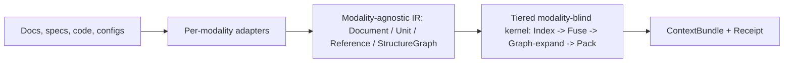

# omnex system overview

> Universal, structure-aware retrieval — at a fraction of the tokens.

## 1. Status

Pre-implementation design.

## 2. What it is

omnex is a deterministic, local-first retrieval engine for structured corpora: docs, specs, code, and configs. It ingests each modality through a dedicated adapter, normalizes the result into one modality-agnostic intermediate representation, and runs a tiered, modality-blind kernel over that IR. The kernel indexes units, fuses signals, expands along structural edges, and packs complete units into a fixed token budget instead of spraying fragments into the prompt.

The stable contract is the IR: `Document`, `Unit`, `Reference`, and `StructureGraph`. `Unit` is the retrieval and packing atom; `Reference` carries typed edges such as containment, cross-links, imports, foreign keys, and `$ref` dependencies; `StructureGraph` is the graph the kernel traverses. The output is a `ContextBundle` for the model and a `Receipt` explaining what was included, what tier ran, which models were or were not used, and how many tokens were returned.

## 3. Why

1. **Token waste matters, but pure cost savings erode as a wedge.** Naive retrieval either dumps whole documents or retrieves fixed-size chunks that are larger than necessary and often incomplete. Input pricing still spans roughly $0.10-$30 per 1M tokens, with mainstream pricing around $2.50-$3, but prices fell by about 80% from early 2025 to early 2026. That means "we save money" is real but not durable by itself; omnex needs to win on quality as well as efficiency. Sources: [cloudzero](https://www.cloudzero.com/blog/llm-api-pricing-comparison/), [PE Collective](https://pecollective.com/blog/llm-api-pricing-comparison/).

2. **Context rot is the durable problem.** Bigger context windows do not remove the retrieval problem; they often make it harder. Chroma's July 2025 study reports degradation as context length increases across frontier models, with serious deterioration by roughly 50K tokens inside 200K-token windows and 30-50% accuracy drops. The older "lost in the middle" result shows that accuracy can drop by more than 30% when relevant information sits mid-context. If long contexts decay, then reducing irrelevant tokens is not just a cost optimization; it is a correctness optimization. Sources: [Chroma](https://www.trychroma.com/research/context-rot), [Morph](https://www.morphllm.com/context-rot), [Glasp](https://glasp.co/articles/context-rot-rag-long-context-hybrid), [Emergent Mind / Lost in the Middle](https://www.emergentmind.com/papers/2307.03172).

3. **Distractor interference hurts answer quality.** Semantically similar but irrelevant context can mislead the model, especially when retrieval returns fragments that look related but omit the structurally necessary neighbors. omnex's core quality claim is therefore precision: fewer, complete, on-target units should improve answers because they reduce distractor load. This is the strongest durable argument for the product. Sources: [Chroma](https://www.trychroma.com/research/context-rot), [Morph](https://www.morphllm.com/context-rot), [Emergent Mind / Lost in the Middle](https://www.emergentmind.com/papers/2307.03172).

4. **There is a determinism and reproducibility gap in mainstream RAG.** Embedding retrieval depends on model choice, ANN behavior, and extra infrastructure, which makes exact replay and auditability harder. The target users here are the teams that care about byte-stable local retrieval, offline operation, and an auditable receipt for CI, regulated workflows, and air-gapped environments. omnex is built to serve that gap first, rather than treating it as an afterthought.

5. **Retrieval is not dead despite big windows.** The practical architecture in 2026 is hybrid: retrieve the best 50K-200K tokens, then spend the long context window on reasoning. A useful field heuristic is that below roughly 100K tokens you may skip retrieval, from 100K to 1M it depends on freshness and task shape, and above 1M retrieval becomes mandatory. Bigger windows increase the need for precision because uncontrolled context both costs more and rots faster. Source: [Glasp](https://glasp.co/articles/context-rot-rag-long-context-hybrid).

## 4. How

omnex resolves an impossible triangle. In any single configuration, you cannot hold all three at once: (A) modality = prose, (B) lanes = FTS-only, and (C) win bar = beat embeddings. On prose, lexical-only retrieval under-recalls semantic search, so (C) fails. The result is a tiered ladder, not a single monotonic performance slider.

| Tier | Adds | Determinism class | Where it bites | Win bar / claim | Headline baseline |
| --- | --- | --- | --- | --- | --- |
| **T0** (default floor) | FTS5/BM25F + efficiency packer | byte-exact, LLM-free, offline | any modality | "far fewer tokens than full-dump; zero model; reproducible; auditable" | full-document dump (upper bound) |
| **T1** | deterministic graph **closure** expansion | byte-exact, LLM-free | structured specs / code (real `$ref`/FK/import deps) | "complete reference-closure at budget; tokens <= chunk-and-embed at equal recall" | chunk-and-embed top-k |
| **T2** | local embedding lane (opt-in extra) | reproducible only with pinned model + tokenizer + runtime + arch | prose / NL queries | "tokens <= chunk-and-embed at equal recall on prose" | chunk-and-embed (STRONG config) |
| **T3** | model extraction (OCR / caption / transcribe) | cached-by-content-hash, model-versioned in receipt | scanned PDF / perceptual (image/audio/video) | "structured retrieval over non-text inputs at all" | coverage, not tokens |

Three product principles fall out of that ladder.

- **Structure is the moat where structure is real.** In specs and code, the interesting edges are hard edges: `$ref`, foreign keys, imports, calls. If a retrieved unit depends on those neighbors, the correct operation is deterministic closure, not hoping semantic similarity happens to retrieve them.
- **Deterministic first, with honest tier boundaries.** T0 is the safe default floor and T1 is still fully deterministic and model-free on the strongest-moat modalities. On prose, the deterministic tiers honestly trail embeddings on recall; only T2 closes that gap, and T2 must be labeled as a weaker determinism class.
- **Receipts are part of the product, not logging garnish.** The `Receipt` states what ran, what was included, which models were invoked or not invoked, and what the token outcome was. That is how omnex turns retrieval from a heuristic black box into an auditable step.

The v0 recommendation is to prove T1 first on structured specs such as OpenAPI, JSON Schema, protobuf, SQL DDL, and dbt. That is the narrowest first proof that is both on-moat and still fully deterministic. T0 still serves every modality, including prose, from day one as the honest deterministic floor. The alternative is to lead with prose plus the T2 vector lane because prose demand is larger, but that would start in the weakest-moat modality and dilute the determinism headline immediately.

## 5. Market research

### RAG market

RAG market estimates cluster around roughly $1.5-$2.3B in 2025, $2.8-$3.3B in 2026, and about $10-$11B by 2030, with published CAGR figures ranging from roughly 38% to 49% depending on the analyst framing. That is large enough to matter, growing fast enough to support new entrants, and fragmented enough that the positioning question matters more than the existence question. Sources: [MarketsandMarkets](https://www.marketsandmarkets.com/Market-Reports/retrieval-augmented-generation-rag-market-135976317.html), [Grand View Research](https://www.grandviewresearch.com/industry-analysis/retrieval-augmented-generation-rag-market-report), [Precedence Research](https://www.precedenceresearch.com/retrieval-augmented-generation-market), [Mordor Intelligence](https://www.mordorintelligence.com/industry-reports/retrieval-augmented-generation-market).

### Vector database market and competitive landscape

The adjacent vector database market is already substantial at roughly $2.55-$2.65B in 2025, with forecasts around $8.9B by 2030. Incumbents and adjacent competitors include Pinecone, Weaviate, Qdrant, Microsoft, Elastic, MongoDB, Google, AWS, Redis, pgvector, Milvus, and Chroma. The important competitive fact is that hybrid search is now table stakes, not novelty, and that hybrid retrieval consistently beats pure-vector retrieval on RAG benchmarks in the current market framing. BM25 + vector fusion is the market default, so omnex cannot credibly position "hybrid" as the differentiator; the differentiation has to be structure-aware packing, deterministic closure, receipts, and local-first operation. Sources: [MarketsandMarkets](https://www.marketsandmarkets.com/Market-Reports/vector-database-market-112683895.html), [GMI Insights](https://www.gminsights.com/industry-analysis/vector-database-market).

### Context-rot trend and token economics

The operating environment pushes buyers toward systems that control context, not just systems that buy bigger windows. Input pricing spans roughly $0.10-$30 per 1M tokens, mainstream pricing sits around $2.50-$3, and caching can make cached reads about 90% cheaper, but falling token prices also weaken a pure cost-savings story. At the same time, the context-rot evidence says that dumping more tokens into the window degrades quality, not just unit economics. omnex therefore benefits from two trends at once: token costs remain nontrivial, and answer quality gets worse when retrieval is imprecise. Sources: [cloudzero](https://www.cloudzero.com/blog/llm-api-pricing-comparison/), [PE Collective](https://pecollective.com/blog/llm-api-pricing-comparison/), [Chroma](https://www.trychroma.com/research/context-rot), [Morph](https://www.morphllm.com/context-rot), [Glasp](https://glasp.co/articles/context-rot-rag-long-context-hybrid), [Emergent Mind / Lost in the Middle](https://www.emergentmind.com/papers/2307.03172).

### ICP and initial segments

The strongest early buyers are the teams that value reproducibility and structure more than generic semantic search alone: regulated environments, air-gapped deployments, CI and code-review pipelines, and organizations that need an auditable retrieval receipt. Within that set, spec-heavy and code-heavy organizations come first because they expose real dependency graphs that let omnex make its strongest claim. Prose-heavy organizations are still in scope, but the honest story there is T0 as the deterministic floor and T2 as the competitive lane.

### Illustrative TAM / SAM / SOM framing

- **TAM [INFERENCE].** A reasonable top-down TAM framing is the 2026 RAG market itself: roughly $2.8-$3.3B today, expanding toward about $10-$11B by 2030. Sources: [MarketsandMarkets](https://www.marketsandmarkets.com/Market-Reports/retrieval-augmented-generation-rag-market-135976317.html), [Grand View Research](https://www.grandviewresearch.com/industry-analysis/retrieval-augmented-generation-rag-market-report), [Precedence Research](https://www.precedenceresearch.com/retrieval-augmented-generation-market), [Mordor Intelligence](https://www.mordorintelligence.com/industry-reports/retrieval-augmented-generation-market).
- **SAM [INFERENCE].** The serviceable market is narrower: the subset of retrieval budgets that need both quality and reproducibility, sitting adjacent to a vector-database market already measured at roughly $2.55-$2.65B in 2025 and growing toward about $8.9B by 2030. Sources: [MarketsandMarkets](https://www.marketsandmarkets.com/Market-Reports/vector-database-market-112683895.html), [GMI Insights](https://www.gminsights.com/industry-analysis/vector-database-market).
- **SOM [INFERENCE].** The realistic initial obtainable market is narrower again: spec-heavy and code-heavy teams inside regulated, air-gapped, or CI-gated environments. The point is not that omnex wins the whole prose-first RAG market first; it is that it can win a defensible wedge where determinism and structural completeness are unusually valuable.

## 6. Risks

| Risk | Severity | Mitigation |
| --- | --- | --- |
| Prose is the weakest-moat beachhead. Prose mostly offers a containment tree, not a dependency graph, so graph expansion has less to bite on and T0/T1 trail embeddings on recall. | Critical | Keep the tiered ladder explicit, lead the first defensible proof on specs with T1, and serve prose with T0 as the floor plus T2 as the competitive lane. |
| Benchmark self-grading can make the headline claim meaningless. "Tokens <= chunk-and-embed at equal recall" only matters if the baseline is strong and the labels are unbiased. | Critical | Pin the baseline to a named strong config, pre-register query count and labeling procedure, track inter-annotator agreement, and prefer a public or third-party labeled set. |
| PDF "deterministic structure" can be overclaimed. Real PDFs scramble read order, tables, outlines, and ligatures; deterministic bytes do not imply deterministic structure. | High | Scope structured text first, report extraction fidelity as its own metric on a messy PDF subset, and keep OCR inside T3 as an explicit opt-in. |
| The IR could be frozen too early, before a second adapter validates it. Generality imagined in advance is usually wrong in detail. | High | Build the kernel against synthetic IR fixtures plus the first real adapter, version the IR, and expect revision when adapter #2 lands instead of marketing the IR as immutable. |
| Determinism degrades exactly where the prose headline lives. T2 vector retrieval is not byte-stable across architectures. | Med-High | Keep T0/T1 byte-exact, label T2 as a distinct determinism class in the receipt, pin model and version details, and never let "deterministic" implicitly cover T2. |
| `COMPRESS` is underspecified and could smuggle a model into deterministic tiers. | Med | Define `COMPRESS` as deterministic extractive or stub behavior only, and enforce that constraint with a packer test that proves T0/T1 invoke no model. |
| Demand for specs is smaller than demand for prose. The strongest moat may be the narrower market. | Med | Sequence the business deliberately: bank credibility on specs first, then expand into prose and code with the same shared kernel. |
| "Hybrid" is table stakes. The market already expects BM25 + vector fusion. | Med (competitive) | Differentiate on structure-aware packing, determinism, receipts, and zero-infra local-first deployment rather than on hybrid search itself. |

## 7. Possible moat

The plausible moat is not "we also do hybrid search." That is already table stakes, and incumbents can copy most isolated retrieval features over time. The real question is whether omnex can make a combined claim that is difficult to match in one system.

The strongest candidate is **structure-as-dependency-graph**. Where the corpus has real edges such as `$ref`, imports, calls, and foreign keys, completeness is not a fuzzy ranking preference; it is a correctness property. If you retrieve an OpenAPI operation, you need its schema closure. If you retrieve a function, you may need its callees. omnex's deterministic closure operation turns that into a product claim embeddings only approximate probabilistically.

The second candidate is **determinism plus auditability**. T0 and T1 are byte-stable, model-free, and offline. The `Receipt` shows exactly what was returned, what tier ran, and whether any extraction model was invoked. That matters for reproducible pipelines, regulated workflows, air-gapped environments, and CI gates in a way mainstream vector-first stacks do not optimize for.

The third candidate is **quality via precision, not just cost via fewer tokens**. Falling token prices erode a pure savings pitch. Hybrid retrieval is already expected. Incumbents could add better structural chunking. The durable edge, if there is one, is the combination of structural closure, deterministic packing, receipts, and local-first deployment, all aimed at reducing distractor interference so answer quality improves. That erosion analysis needs to stay explicit: prose is the weakest-moat modality, hybrid is not novel, and cost savings alone will not hold the line.

## 8. Examples

### Example A — structured specs (the strong-moat proof, T1)

Corpus: an OpenAPI spec. Query: "What's the request/response shape for creating a payment?"

Real dependency graph:

- `POST /payments` (OPERATION) --`$ref` req--> `PaymentRequest`
- `POST /payments` --`$ref` resp--> `Payment`
- `PaymentRequest` --`$ref`--> `Money`
- `PaymentRequest` --`$ref`--> `Customer`
- `Customer` --`$ref`--> `Address`
- `Payment` --`$ref`--> `Money` (shared)

- chunk-and-embed baseline: retrieves `POST /payments` plus probably `PaymentRequest`, but misses `Money` and `Address` because their names are not semantically near the query. The returned context is structurally incomplete: you cannot build a valid request body. To compensate, you raise `k`, drag in unrelated schemas, blow up tokens, and lose precision.
- omnex (T1): FTS finds `POST /payments`, then graph expansion walks the `$ref` closure deterministically and pulls exactly `PaymentRequest -> {Money, Customer -> Address}` plus the response closure `Payment -> Money`, deduping shared `Money` before packing. The result is complete, minimal, and completeness is provable because it is the transitive closure, not a probabilistic guess. This is the archex idea of "retrieve function -> must include callees" transferred faithfully to specs.

### Example B — prose (the high-demand, weak-moat case; T0 honest, T2 competitive)

Corpus: product docs of about 40K tokens. Query: "How do I configure TLS for the ingress controller?"

Relevant content: an `Ingress` section, a `TLS secrets` subsection with a YAML manifest, and a cross-linked page titled "Securing traffic with certificates" that never says "TLS."

- **T0 (FTS-only):** matches the `TLS` and `Ingress` sections but misses "Securing traffic with certificates" on vocabulary mismatch. Graph expansion partially rescues it only if that page is already a `CROSS_REF` neighbor. Report this honestly: T0 trails embeddings on recall for this prose query. The win shown here is versus full dump: about 1.3K returned tokens versus an illustrative 40K-token dump, with zero model use and reproducible output.
- **T2 (+ vector lane):** the vector lane catches "Securing traffic with certificates" semantically; reciprocal-rank fusion combines that with lexical hits; graph expansion pulls the protected manifest and cross-ref page; the packer drops filler. Versus a naive chunk-and-embed baseline that retrieves about eight fixed chunks, several are fragments that splice half-sections with unrelated material. omnex spends budget on coherent whole units plus the protected manifest. Illustrative outcome: about 1.4K tokens for omnex versus about 2.0K for the baseline at equal recall.
